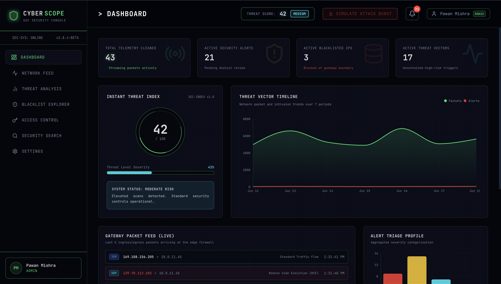
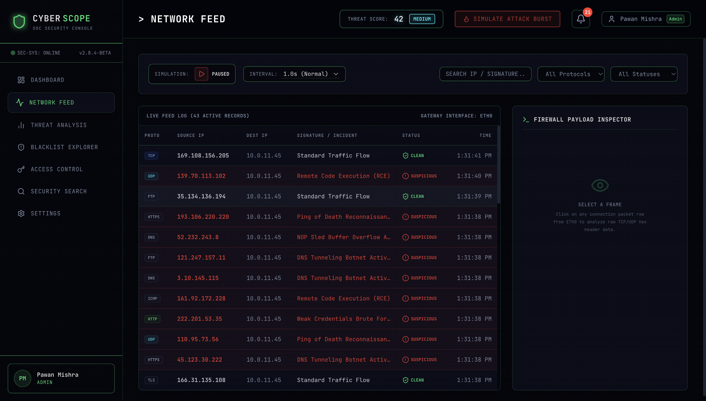
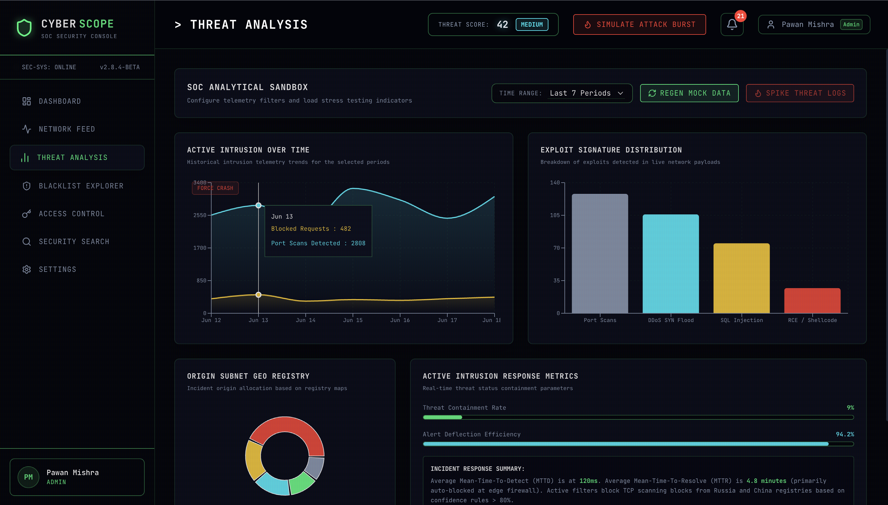
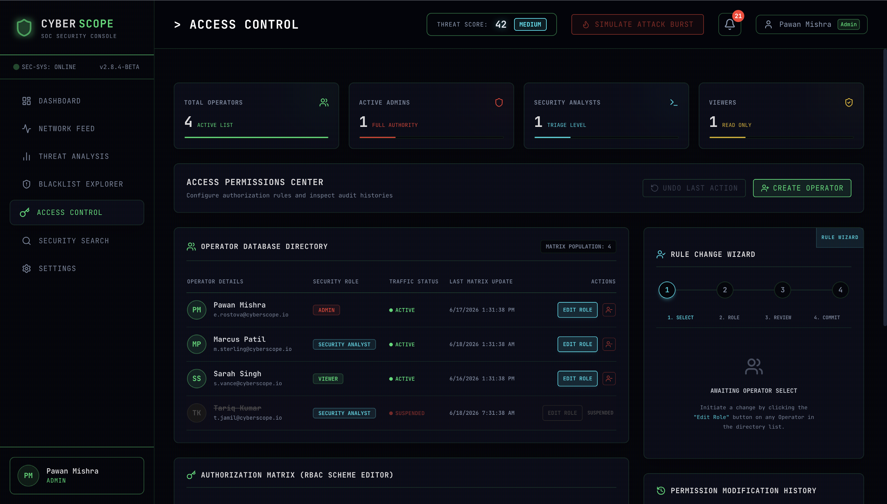
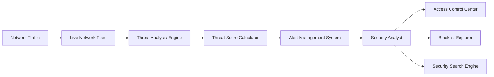
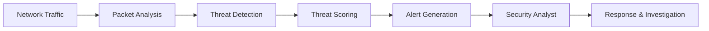

<div align="center">

# 🛡️ CYBERSCOPE

### Real-Time Cybersecurity Monitoring & Threat Intelligence Dashboard

<p align="center">
Monitor • Detect • Analyze • Respond
</p>

<p align="center">


</p>

---

### 🚨 Enterprise Security Operations Center (SOC) Simulation

CyberScope is a modern cybersecurity dashboard built with React that simulates real-world Security Operations Center workflows including threat monitoring, network intelligence, blacklist investigation, role-based access control, and advanced threat hunting.


</div>

---

# ⚡ Features

<table>
<tr>
<td width="50%">

### 📡 Live Network Monitoring

* Real-time packet simulation
* Threat detection indicators
* Gateway monitoring
* Traffic intelligence

</td>

<td width="50%">

### 🎯 Threat Intelligence

* Risk scoring engine
* Threat classification
* Severity tracking
* Attack analytics

</td>
</tr>

<tr>
<td>

### 🚨 Alert Management

* Active security alerts
* Incident monitoring
* Alert prioritization
* Queue processing

</td>

<td>

### 🌐 Blacklist Explorer

* Massive IP registry
* Instant search
* Threat reputation
* Fast filtering

</td>
</tr>

<tr>
<td>

### 🔐 Access Control

* RBAC management
* User permissions
* Role assignment
* Undo changes

</td>

<td>

### 🔎 Security Search

* Regex-based hunting
* Threat discovery
* Payload analysis
* Match highlighting

</td>
</tr>
</table>

---

# 🖥️ Dashboard Modules

```text
┌─────────────────────────────────────────────┐
│                 CYBERSCOPE                   │
├─────────────────────────────────────────────┤
│ Threat Score │ Alerts │ Blacklisted IPs     │
├─────────────────────────────────────────────┤
│        Threat Analytics & Monitoring         │
├─────────────────────────────────────────────┤
│          Live Network Packet Feed            │
├─────────────────────────────────────────────┤
│      Access Control & Security Search        │
└─────────────────────────────────────────────┘
```

---

# 📸 Screenshots

## 🖥️ Dashboard Overview

<p align="center">
  
</p>

### Highlights
- 🎯 Instant Threat Score Monitoring
- 🚨 Active Security Alerts Tracking
- 🌐 Blacklisted IP Intelligence
- 📡 Live Gateway Packet Feed
- 📈 Threat Vector Timeline Analytics

---

## 📡 Live Network Feed

<p align="center">
  
</p>

### Highlights
- 🔄 Real-Time Packet Monitoring
- 🌍 Source & Destination IP Tracking
- 📶 Protocol Inspection
- 🚨 Suspicious Traffic Detection
- 🛡️ Firewall Payload Inspector
- 🔍 Advanced Filtering & Search

---

## 📊 Threat Analysis Center

<p align="center">
  
</p>

### Highlights
- 📈 Active Intrusion Detection Analytics
- 🎯 Exploit Signature Distribution
- 🌐 Threat Origin Intelligence
- ⚡ Threat Containment Metrics
- 📊 Historical Security Trends
- 🛡️ Incident Response Statistics

---

## 🔐 Access Control Center

<p align="center">
  
</p>

### Highlights
- 👥 Role-Based Access Control (RBAC)
- 🔑 User & Permission Management
- 🧙 Rule Change Wizard
- 📝 Permission Modification History
- 🔄 Undo Last Action Functionality
- 🛡️ Security Role Administration

---

# 🏗️ System Architecture



---

# 🎥 Application Workflow

```text
Network Packet Generated
          ↓
Live Feed Monitoring
          ↓
Threat Analysis
          ↓
Threat Score Calculation
          ↓
Security Alert Generation
          ↓
Analyst Investigation
          ↓
Access Control & Response
```

---

# 📂 Repository Structure

```bash
CyberScope
│
├── screenshots
│   ├── dashboard.png
│   ├── network-feed.png
│   ├── threat-analysis.png
│   └── access-control.png
│
├── src
│   ├── components
│   ├── pages
│   ├── context
│   ├── data
│   └── utils
│
├── public
│
├── package.json
│
└── README.md
```

---

# 🎯 Problem Statement Coverage

| Requirement                | Status |
| -------------------------- | ------ |
| Live Network Feed          | ✅      |
| Rule Change Guide          | ✅      |
| Smooth Alert Handler       | ✅      |
| Endless Blacklist Explorer | ✅      |
| Instant Threat Score       | ✅      |
| Access Permissions Center  | ✅      |
| Graph Crash Protector      | ✅      |
| Custom Security Search     | ✅      |

---

# 🔄 System Workflow



---

# 🔮 Future Enhancements

* WebSocket Integration
* Real Packet Capture
* Threat Intelligence APIs
* AI-Based Threat Prediction
* Multi-User Collaboration
* Export Security Reports

---

# ⚠️ Disclaimer

CyberScope uses simulated network telemetry and mock security events for educational purposes.

---

<div align="center">

### ⭐ Star this repository if you like the project

Built with ❤️ using React

</div>
